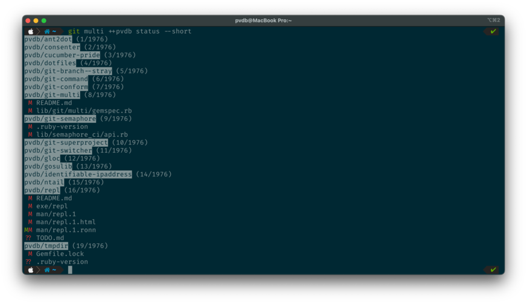

# `git-multi`

## Summary

Execute the same `git` command in a set of related repos.

There are plenty of other utilities out there that do something similar, but typically they only support a limited number of hard-coded `git` commands which can be executed in multiple repositories.

`git-multi` is different: any `git` command _(including any `git` extensions you may have installed or any `git` aliases you may have defined)_ can be executed in multiple repositories.

`git-multi` only concerns itself with iterating over the set of related repos; what it executes in each of them is completely up to you.

## Example

The man page shows other uses and options for `git multi` but its main purpose is to iterate over a list of related git repositories _(known as a "multi-repo")_ and execute the same git command in each and every one:



A typical `git multi` invocation has the following anatomy:

```
$ git multi ++pvdb status --short
 └─┬───────┘
   └─► invoke the custom "git-multi" subcommand

$ git multi ++pvdb status --short
           └──┬───┘
              └─► specify the name of a multi-repo (optional)

$ git multi ++pvdb status --short
                  └──────┬───────┘
                         └─► regular git command or alias, incl. options
```

In the above example, the `git status --short` command is executed in each git repository in the `++pvdb` multi-repo; the name of the multi-repo (`++pvdb` in the above example) is optional: without it `git multi` will iterate over *all* git repos in *all* configured multi-repos.

## Features

* execute any `git` command, extension and alias in multiple repositories _(not just a limited set of pre-packaged commands)_
* human-friendly output in interactive mode _(akin to [git porcelain][p-p] commands)_, for every day use
* machine parseable output in non-interactive mode _(akin to [git plumbing][p-p] commands)_, for advanced scripting and automation

[p-p]:    https://git-scm.com/book/en/v2/Git-Internals-Plumbing-and-Porcelain

## Prerequisites

`git-multi` is a Ruby script, so you will have to have Ruby installed on your system _(system Ruby, [RVM][], [rbenv][], etc)_.

`git-multi` is also tightly coupled to your [GitHub][] account _(via the github API)_, so you will also need to generate a so-called [personal access token][token] and install it in your git config _(instructions provided below)_.

[rvm]:    https://rvm.io
[rbenv]:  http://rbenv.org
[github]: https://github.com
[token]:  https://github.com/settings/tokens

## Installation

    $ gem install git-multi

## Usage

Installing the gem installs the `git-multi` executable on your system's `${PATH}`, which means it can be run as a so-called [git subcommand](https://git.github.io/htmldocs/howto/new-command.html#:~:text=Runtime%20environment), as follows:

    $ git multi

A good starting point is the `git-multi` man page:

    $ git multi -h

... or if you prefer to read it in a web browser:

    $ git multi --html

## Known Issues

1. it probably doesn't work on Windows

## Contributing

1. Fork it ( https://github.com/pvdb/git-multi/fork )
2. Create your feature branch (`git checkout -b my-new-feature`)
3. Commit your changes (`git commit -am 'Add some feature'`)
4. Push to the branch (`git push origin my-new-feature`)
5. Create a new Pull Request
